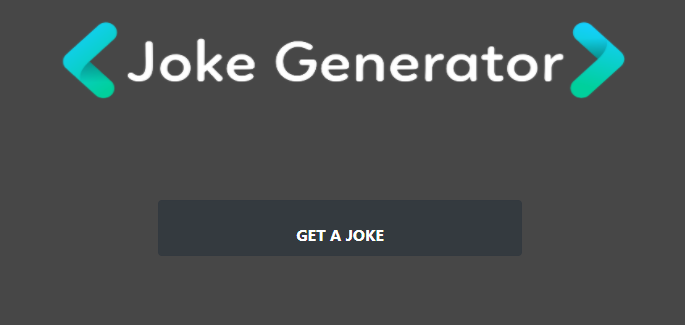
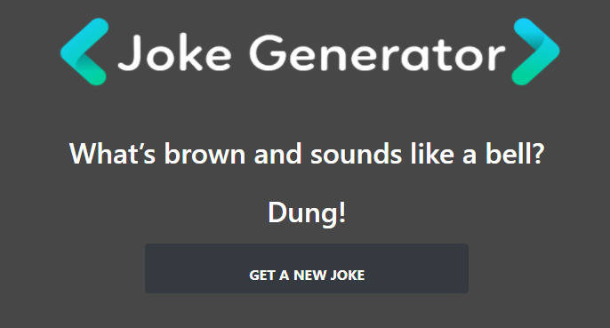

# Joke Generator

Recreated my joke-generator page made with vanilla javascript using React. 

Link to API-Fun page made with vanilla javascript.
https://app.netlify.com/sites/cs-learn-api/overview

## Screenshot

First Screen

After you click "Get A Joke" button

After you click "Get Punchline" button

